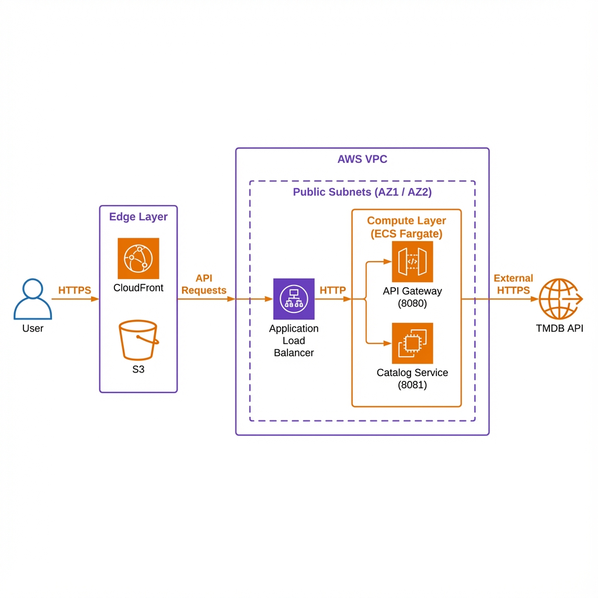
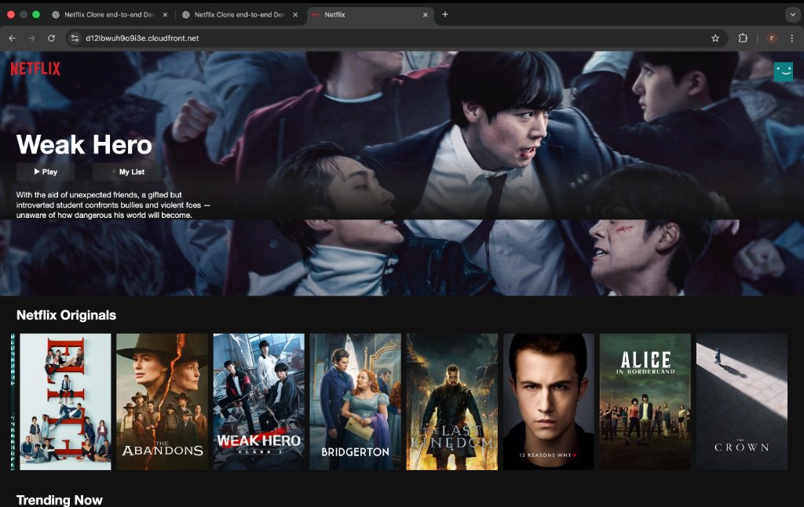
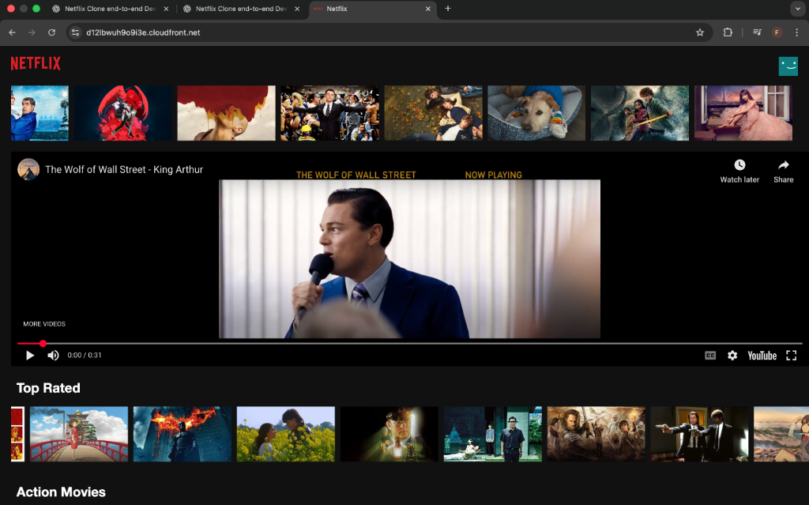

# 🚀 Netflix End-to-End DevSecOps Project


> **A production-grade, cloud-native streaming platform built to demonstrate advanced DevSecOps practices, microservices architecture, and secure infrastructure deployment.**

---

## 📖 About The Project

This project is a comprehensive clone of the Netflix platform, designed not just as a UI copy but as a robust engineering showcase. It evolves a monolithic application into a scalable **Microservices Architecture**, integrating a full **DevSecOps pipeline** from the ground up.

It demonstrates mastery of:
*   **Microservices Decomposition**: Breaking down a monolith into functional services (Catalog, User, Video).
*   **API Gateway Pattern**: Using a BFF (Backend for Frontend) to manage traffic and secure internal APIs.
*   **Containerization & Orchestration**: Production-ready Docker setups and orchestration.
*   **Security First**: Hardened networking, secure configurations, and planned automated security scanning.

---

## 🏗️ Architecture

The application is deployed on AWS using ECS Fargate, CloudFront, and Application Load Balancers.



---

## 📸 Screenshots & Artifacts

### Home Page (Netflix Originals & Trending)


### Video Playback (Integration with Backend Proxy)


---

## 📂 Directory Structure

```text
├── frontend/                # React Vite Frontend
│   ├── src/
│   ├── Dockerfile
│   └── dist/                # Production build artifacts
├── services/                # Microservices
│   ├── api-gateway/         # Node.js API Gateway (BFF)
│   ├── catalog-service/     # Movie Catalog Service
│   └── user-service/        # (Planned) User Management
├── infra/                   # Terraform Infrastructure Code
│   ├── alb.tf               # Load Balancer Config
│   ├── ecs.tf               # ECS Cluster & Tasks
│   ├── cloudfront.tf        # CDN Configuration
│   └── networking.tf        # VPC, Subnets, Security Groups
├── docker-compose.yml       # Local Development Orchestration
└── README.md                # Project Documentation
```

---

## 🔧 Engineering Journey & Troubleshooting

Building this project involved solving complex real-world infrastructure challenges. Here is a summary of the key technical hurdles overcome:

### 1. The "504 Gateway Timeout" Outage
**Issue**: The ALB could not reach the ECS tasks, causing timeouts.
**Root Cause**: Security Group misconfiguration. The ECS Security Group allowed ingress on Port 80, but the Node.js containers were listening on Port 8080.
**Fix**: Updated Terraform `networking.tf` to allow ingress on Port 8080 from the ALB.

### 2. The "Exec Format Error" (Architecture Mismatch)
**Issue**: ECS tasks crashed immediately upon startup with `exec /usr/local/bin/docker-entrypoint.sh: exec format error`.
**Root Cause**: Docker images were built on an Apple M1 (ARM64) machine, but Fargate runs on x86_64 (AMD64).
**Fix**:
*   Implemented `docker buildx` for multi-platform builds.
*   Added `.dockerignore` to exclude local `node_modules` (ARM64 binaries) from corrupting the container build context.

### 3. The "Sticky Deployment" (Stale Cache)
**Issue**: Even after pushing fixed images, ECS continued to run the old, broken code.
**Root Cause**: ECS aggressively caches the `latest` image tag.
**Fix**: Implemented immutable image tagging (e.g., `api-gateway:v4`) and explicitly updated the ECS Task Definitions to force a fresh pull of the new code.

### 4. Frontend Layout & Playback
**Issue**: Vertical scrolling bugs and missing video playback.
**Fix**: Debugged CSS Flexbox issues and implemented a backend proxy in the API Gateway to securely fetch video trailers from TMDB without exposing Keys to the client.

---

## 🛠️ Tech Stack

### Core
*   **Frontend**: React, Vite, TailwindCSS (for styling)
*   **Backend**: Node.js, Express
*   **Database**: MongoDB (Mongoose)

### Infrastructure & DevOps
*   **Compute**: AWS ECS Fargate
*   **Networking**: AWS ALB, CloudFront, VPC
*   **IaC**: Terraform
*   **Containerization**: Docker, Docker Buildx
*   **CI/CD**: GitHub Actions (Planned)

---

## 🚀 Getting Started

Follow these steps to get the project running locally in minutes.

### Prerequisites
*   Docker & Docker Compose installed.
*   Git installed.
*   A [TMDB API Key](https://www.themoviedb.org/documentation/api).

### Installation

1.  **Clone the repository**
    ```bash
    git clone https://github.com/Fardeen2812/Netflix-clone-Devsecops-pipeline.git
    cd Netflix-end2end-devsecops-project
    ```

2.  **Configure Environment**
    Create a `.env` file in the root directory:
    ```bash
    echo "TMDB_API_KEY=your_actual_api_key_here" > .env
    ```

3.  **Start Services**
    Spin up the entire stack using Docker Compose:
    ```bash
    docker-compose up --build -d
    ```

4.  **Access the Application**
    *   **Frontend**: [http://localhost:5173](http://localhost:5173) (if running locally) or accessible via Gateway.
    *   **API Gateway**: [http://localhost:8080/health](http://localhost:8080/health)

---

## 👨‍💻 Author

**Fardeen Ali**
*Cloud Engineer | DevOps Enthusiast | AWS Solutions Architect*

[](https://www.linkedin.com/in/fardeen-aliii)
